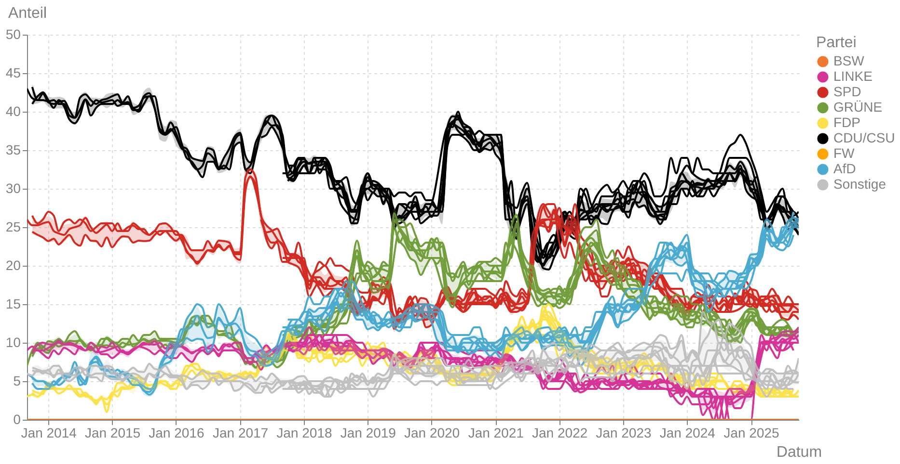

# dawum-crawl

## Data

The parsed data from DAWUM is available as a `.csv` file: [Download](https://raw.githubusercontent.com/thomascamminady/dawum-crawl/refs/heads/main/data/dawum.csv)

## Info

Find this repository on [Github](https://github.com/thomascamminady/dawum-crawl) or check out the [documentation](https://thomascamminady.github.io/dawum-crawl).

## Development

Set up the full project by running `make`.

## Documentation

Go to `Settings->Pages` and set `Source` (under `Build and deployment`) to `Github Actions`.

## Credits

[DAWUM Urheberrecht](https://dawum.de/Urheberrecht/):
Die Inhalte dieser Website dawum.de unterliegen dem deutschen Urheberrecht. Sie können, sofern nicht anders bestimmt, die Inhalte im Rahmen der Lizenz Creative Commons CC BY-NC-SA 4.0 teilen und bearbeiten, wenn

    - Urheber und Lizenz ordnungsgemäß genannt werden,
    - die Quelle verlinkt wird,
    - die Nutzung nicht-kommerziell ist und
    - die Weitergabe unter der gleichen Lizenz erfolgt

This package was created with [`cookiecutter`](https://github.com/audreyr/cookiecutter) and [`thomascamminady/cookiecutter-pypackage`](https://github.com/thomascamminady/cookiecutter-pypackage), a fork of [`audreyr/cookiecutter-pypackage`](https://github.com/audreyr/cookiecutter-pypackage).
